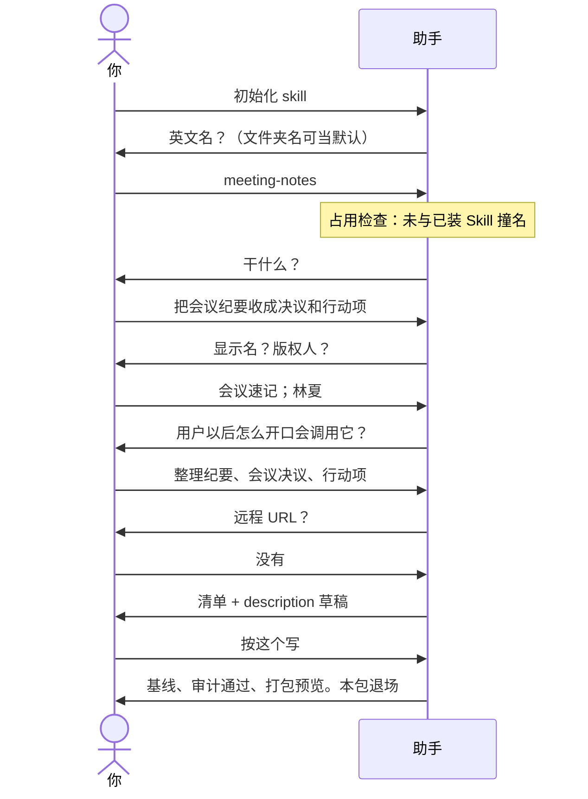
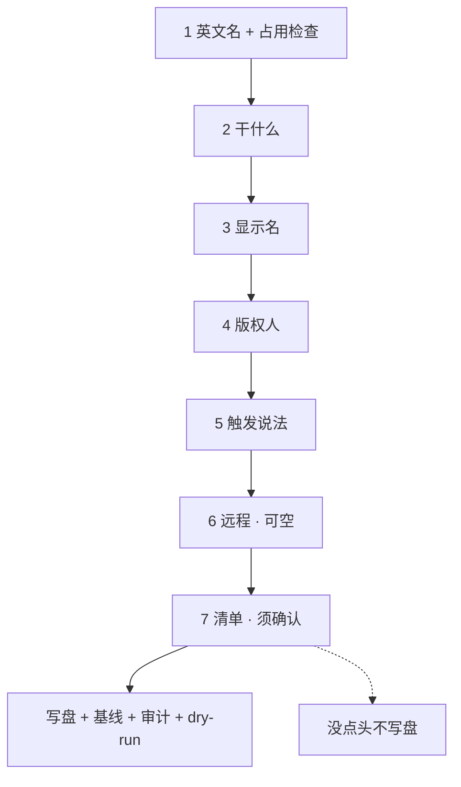

# 示例：初始化空文件夹

新 Skill 还没有仓库。新建一个空文件夹，把助手工作区指过去。清单没点头之前不写盘。结束时亮审计和打包预览。

> 假设定：作者林夏。空文件夹 `meeting-notes/`。要做的 Skill 叫会议速记。

---

## 全过程





### 第 1 轮 · 开口

**你**

> 初始化 skill。

**助手**

> 当前文件夹是空的，可以初始化成 Skill 开发仓。
>
> 英文名 `name`：小写字母、数字、连字符，2–64 个字符，头尾是字母或数字。
>
> 文件夹叫 `meeting-notes`，可以用这个当名字。要这个，还是另起一个？

**你**

> 就用 meeting-notes。

---

### 第 2 轮 · 干什么（占用未撞名，不单独汇报）

**助手**

> 这个 Skill 干什么？一句话就行：做什么、什么时候用。

**你**

> 把会议纪要收成决议和待办行动项。我贴一段纪要，它整理出来。

---

### 第 3 轮 · 显示名

**助手**

> 给人看的中文名。我建议：会议速记。要用这个，还是另起？

**你**

> 会议速记。

---

### 第 4 轮 · 版权

**助手**

> LICENSE 上的版权人。默认「仇索」，须你点头。要默认，还是改成别人？

**你**

> 改成林夏。

---

### 第 5 轮 · 触发说法

**助手**

> 用户以后怎么开口，助手才会调用这个 Skill？请给 3～8 个说法。也会写成 `/meeting-notes`。
>
> 跳过的话，我从「干什么」里生成，仍会在清单里给你改。

**你**

> 整理纪要、会议决议、行动项、贴一段纪要。

---

### 第 6 轮 · 远程

**助手**

> 有没有 Gitee / GitHub 地址？没有就说没有。不自动建仓，也不 push。

**你**

> 没有。

---

### 第 7 轮 · 清单确认

**助手**

> 按下面写。要改哪条直接说；说「按这个写」我就落盘。
>
> - 版本 `0.1.0`（脚手架诞生，无业务能力）
> - 许可证 MIT
> - 中文 README
> - 在工作区根 `git init`
> - 首提交
> - `governance/`：版本控制、基线、升级记录、变更门禁、打包、审计
> - 出生证明：`CR-000-init`、`upgrade-to-0.1.0.md`
> - 打 `0.1.0` 基线；跑审计；打包 dry-run（不把 zip 留在仓里）
> - 远程：无
> - `description` 草稿：把会议纪要收成决议和待办行动项。触发：整理纪要、会议决议、行动项、贴一段纪要、/meeting-notes。

**你**

> 按这个写。

---

### 第 8 轮 · 绿灯

**助手**

**落地**：`meeting-notes/` · 英文名 `meeting-notes` · 显示名会议速记 · `0.1.0`

**已写入**：版本控制、冻结基线、升级记录、变更门禁、触发词、打包、审计

**出生证明**：`governance/change-requests/CR-000-init.md`、`governance/migrations/upgrade-to-0.1.0.md`

**绿灯**

- 基线 `governance/baselines/0.1.0/`
- 发布审计：通过
- 打包预览：N 个文件；列表中无 `governance/`、`.git/`、`AGENTS.md`

**退场**：本包用完。以后说「按 `governance/rules/skill-governance.md` 处理，不要直接改」。打包：`powershell -File governance/dev.ps1 pack`

建议下一步：把 `SKILL.md` 路由和 `references/` 写成会议速记真正要做的事。要试用再说，我才会拷到 `~/.grok/skills/meeting-notes/`。

---

## 你可以照着说

```text
初始化 skill。
```

同义口令也可以：`开发一个 skill`、`新建技能`、`从零写 skill`、`/init-skill`。

工作区必须是**那个空文件夹**，不要指到 skill-devkit 自己的仓库上。
