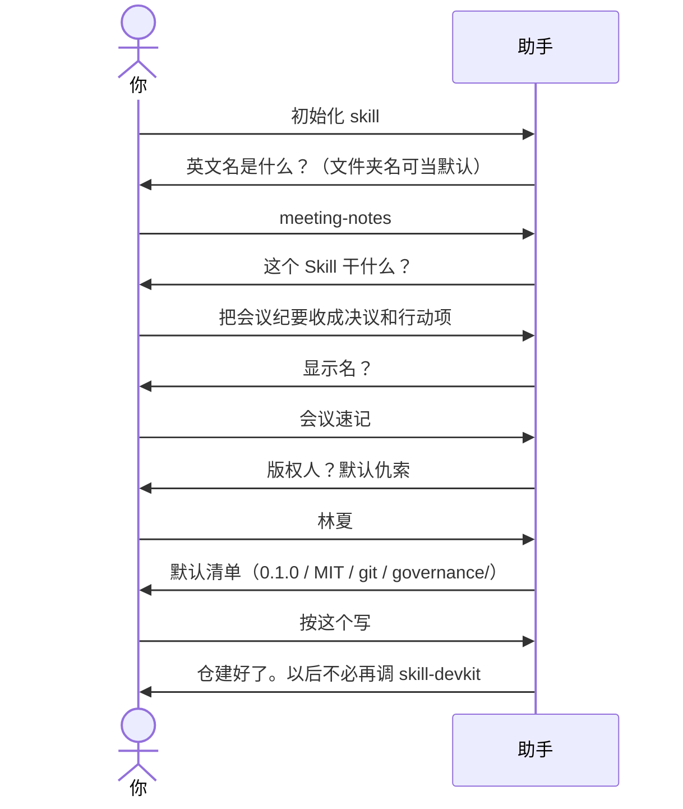
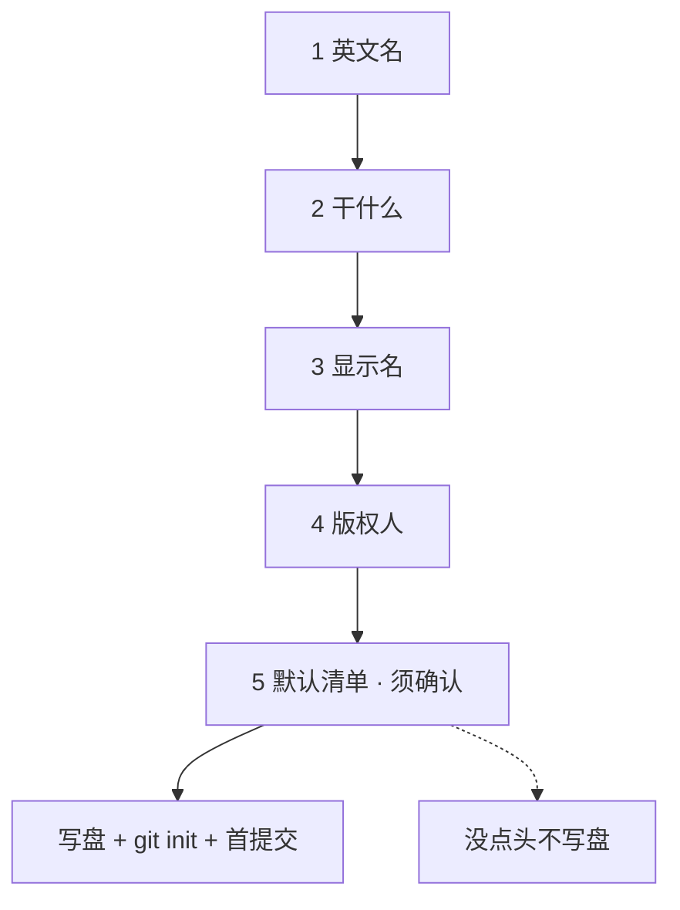

# 示例：初始化空文件夹

新 Skill 还没有仓库。新建一个空文件夹，把助手工作区指过去，开口让它建完整开发仓（代码 + git + 版本控制目录）。清单没点头之前，助手不写盘。

> 假设定：作者林夏。空文件夹 `meeting-notes/`。要做的 Skill 叫会议速记。

---

## 全过程





### 第 1 轮 · 开口

**你**

> 初始化 skill。

**助手**

> 当前文件夹是空的，可以初始化成 Skill 开发仓。
>
> 英文名 `name`：小写字母、数字、连字符，2–64 个字符，头尾是字母或数字。
>
> 文件夹叫 `meeting-notes`，可以用这个当名字。要这个，还是另起一个？

**你**

> 就用 meeting-notes。

---

### 第 2 轮 · 干什么

**助手**

> 这个 Skill 干什么？一句话就行：做什么、什么时候用。

**你**

> 把会议纪要收成决议和待办行动项。我贴一段纪要，它整理出来。

---

### 第 3 轮 · 显示名

**助手**

> 给人看的中文名。我建议：会议速记。要用这个，还是另起？

**你**

> 会议速记。

---

### 第 4 轮 · 版权

**助手**

> LICENSE 上的版权人。默认「仇索」，须你点头。要默认，还是改成别人？

**你**

> 改成林夏。

---

### 第 5 轮 · 清单确认

**助手**

> 按下面写。要改哪条直接说；说「按这个写」我就落盘。
>
> - 版本 `0.1.0`
> - 许可证 MIT
> - 中文 README
> - 在工作区根 `git init`（不在 `governance/` 里）
> - 首提交
> - 建 `governance/`（版本控制与打包，不进分发包）
> - 远程：无
> - `SKILL.md` 的 description 草稿：把会议纪要收成决议和待办行动项。触发：整理纪要、会议决议、行动项、/meeting-notes。
>
> 远程有 URL 的话现在给；没有就保持空。

**你**

> 按这个写。

---

### 第 6 轮 · 建好了

**助手**

```text
meeting-notes/
├── .git/
├── .gitignore
├── LICENSE              版权林夏，MIT
├── README.md
├── CHANGELOG.md         0.1.0
├── SKILL.md
├── skill.json
├── VERSION              0.1.0
├── references/
├── assets/
├── scripts/
└── governance/          版本控制与打包（不进 zip）
    ├── pack/pack.py
    ├── scripts/sync_version.py
    └── templates/       AP / CR / RR 空模板
```

| 记下了 | 还空着 |
|---|---|
| 英文名 `meeting-notes`、显示名会议速记、版权林夏 | `SKILL.md` 路由表还是占位 |
| git 已 init，首提交 `0.1.0 初始化 Skill 仓库` | 远程（你没给 URL，没加） |
| `governance/` 已可打包、同步版本号 | `references/` 细则（下一步你自己写） |

> 本包对这个文件夹的工作结束。以后改规则、升版本、打包都用本仓的 `governance/`，不必再调用 skill-devkit。
>
> 打包：`python governance/pack/pack.py --skill-root .`
> 升版本：改根目录 `VERSION`，再 `python governance/scripts/sync_version.py`
>
> 建议下一步：把 `SKILL.md` 路由和 `references/` 写成会议速记真正要做的事。要试用再说，我才会拷到 `~/.grok/skills/meeting-notes/`。

---

## 你可以照着说

```text
初始化 skill。
```

同义口令也可以：`开发一个 skill`、`新建技能`、`从零写 skill`、`/init-skill`。

工作区必须是**那个空文件夹**，不要指到 skill-devkit 自己的仓库上。
