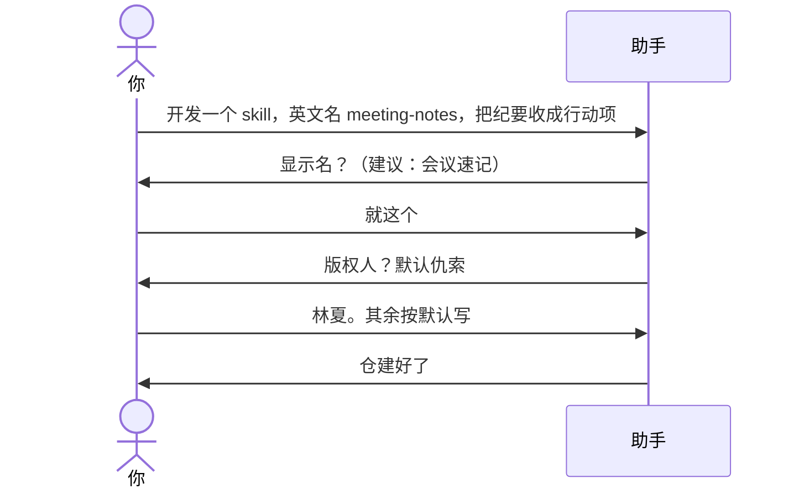

# 示例：一句话带齐信息

开口时已经把英文名和干什么说完了。助手只补缺的（显示名、版权、清单），不要把说过的再问一遍。

> 假设定仍是林夏、`meeting-notes/` 空文件夹。

---

## 全过程



### 第 1 轮 · 开口里已经有两问的答案

**你**

> 开发一个 skill。英文名 meeting-notes。把会议纪要收成决议和待办行动项，我贴纪要它整理。

**助手**

> 英文名 `meeting-notes`、用途都记下了，这两项不再问。
>
> 给人看的中文名。我建议：会议速记。要用这个，还是另起？

**你**

> 就这个。版权人林夏。其余按默认写。

---

### 第 2 轮 · 清单仍要亮出来

即使用户说「其余按默认」，助手仍把清单读一遍（版本、MIT、git、`governance/`、description 草稿），等人点头再写盘。见 [01-初始化空文件夹.md](01-初始化空文件夹.md) 第 5–6 轮。本例不重复贴树。

**助手**（摘要）

> 版本 0.1.0，MIT，根上 git，建 `governance/`。description 按你刚才那句加触发词。说「按这个写」我就落盘。

**你**

> 按这个写。

---

## 你可以照着说

```text
开发一个 skill，英文名 meeting-notes，把会议纪要收成决议和行动项。
```

缺什么问什么。不要把已经出现的英文名再问一次。
