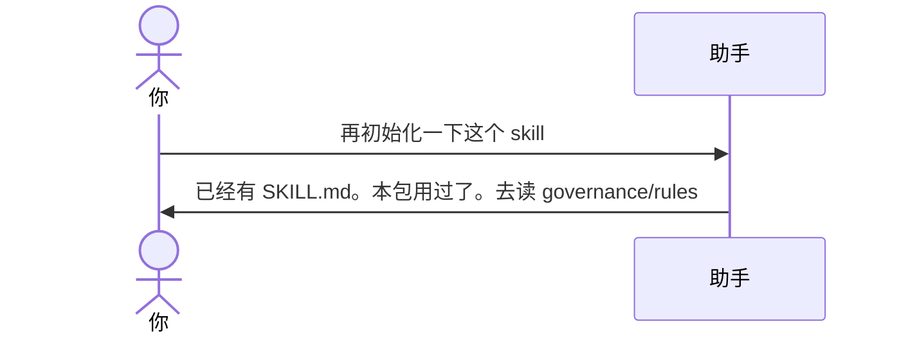

# 示例：已经是 Skill 仓

文件夹里已经有 `SKILL.md`。本包只用一次，再说「初始化」也直接停止。改规则、升版本、打包去读这个仓自己的提示词。

> 假设定：`meeting-notes/` 已经按 [01-初始化空文件夹.md](01-初始化空文件夹.md) 建过。

---

## 全过程



### 第 1 轮

**你**

> 再初始化一下这个 skill。

**助手**

> 这里已经是 Skill 开发仓（根上有 `SKILL.md`，英文名 `meeting-notes`，版本 0.1.0）。
>
> skill-devkit 只用一次，不会再写一遍，也不会改走升级流程。
>
> 以后请把工作区留在本文件夹，对助手说：
>
> ```
> 按 governance/rules/skill-governance.md 处理，不要直接改。先出 AP。
> ```
>
> 版本控制、基线、升级记录、打包都在 `governance/` 里。

---

## 你可以照着说

「初始化 skill」只留给空文件夹。已经建好的仓，换口令：

```text
按 governance/rules/skill-governance.md 处理，不要直接改。先出 AP。
```
