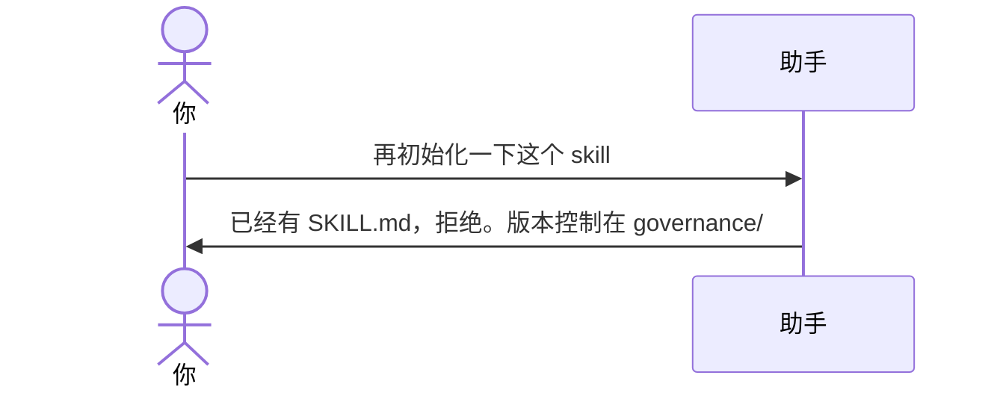

# 示例：已经是 Skill 仓

文件夹里已经有 `SKILL.md`。再说「初始化」也不能重做一遍。本包不是升级引擎，点头之后请去用这个仓自己的 `governance/`。

> 假设定：`meeting-notes/` 已经按 [01-初始化空文件夹.md](01-初始化空文件夹.md) 建过。

---

## 全过程



### 第 1 轮

**你**

> 再初始化一下这个 skill。

**助手**

> 这里已经是 Skill 开发仓（根上有 `SKILL.md`，英文名 `meeting-notes`，版本 0.1.0）。
>
> 本包只负责初始化，不会再写一遍，也不会改走升级流程。
>
> 改规则、升版本、打包用本文件夹的 `governance/`，不必再调用 skill-devkit。例如：
>
> ```
> python governance/scripts/sync_version.py
> python governance/pack/pack.py --skill-root .
> ```

---

## 你可以照着说

不要在已有仓里说「初始化 skill」。那句只留给空文件夹。

若仓是残的（有 `SKILL.md` 但没有 `governance/`），助手会问要不要**只补**版本控制目录，仍不会把 `SKILL.md` 覆盖掉。
