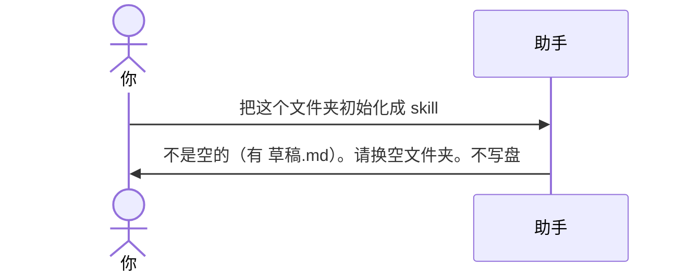

# 示例：非空目录

本包只给空文件夹或空 git 仓用。目录里已经有别的文件，即使还没有 `SKILL.md`，也直接停止，不写盘，不问「能不能在这里初始化」。

> 假设定：`meeting-notes/` 里有一份随手记 `草稿.md`。

---

## 全过程



### 第 1 轮

**你**

> 把这个文件夹初始化成 skill。

**助手**

> 当前目录不是空文件夹，也不是空 git 仓。已经在的文件：
>
> - `草稿.md`
>
> skill-devkit 只在空目录初始化，不会问「能不能在这里写」，也不会删你的文件。
>
> 请新建一个空文件夹，把工作区指过去，再说「初始化 skill」。

---

## 你可以照着说

不要在有笔记、有代码的目录里初始化。先：

```text
（新建空文件夹，选为工作区）
初始化 skill。
```

仅有 `.git/`（还没有任何项目文件）算空仓，可以初始化。仅有 `.DS_Store` / `Thumbs.db` 也算空。
