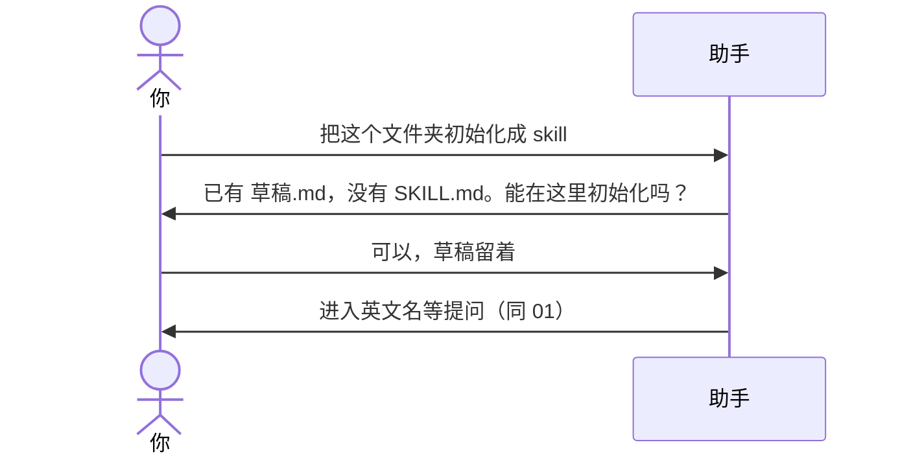

# 示例：非空目录

文件夹里已经有别的文件，但还没有 `SKILL.md`。助手先列出已有文件，你明确同意才开始提问。

> 假设定：`meeting-notes/` 里有一份随手记 `草稿.md`，没有 Skill 文件。

---

## 全过程



### 第 1 轮 · 先亮已有文件

**你**

> 把这个文件夹初始化成 skill。

**助手**

> 这个目录不是空的，也还没有 `SKILL.md`。已经在的文件：
>
> - `草稿.md`
>
> 能不能在这里初始化？同意的话我会留下这些文件，再往里加 Skill 开发仓。首提交默认**不**把 `草稿.md` 加进去，除非你要求纳入。

**你**

> 可以，草稿留着，不要进 git。

---

之后问答与 [01-初始化空文件夹.md](01-初始化空文件夹.md) 相同。git 只 add 本流程写出的路径。

---

## 你可以照着说

```text
把这个文件夹初始化成 skill。已有的笔记留着，不要删。
```

没明确同意之前，助手不开始问英文名，更不写盘。
