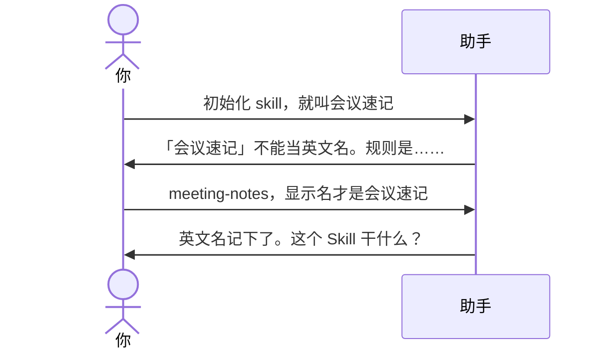

# 示例：名称不合法

英文名只允许小写字母、数字、连字符。用中文、空格、下划线当 `name` 会卡住，助手指出规则再问，不往下走、不写盘。

> 假设定：空文件夹。林夏先随口说了中文名。

---

## 全过程



### 第 1 轮

**你**

> 初始化 skill，就叫会议速记。

**助手**

> 「会议速记」不能当英文名 `name`。
>
> 规则：小写字母 `a-z`、数字、连字符 `-`；2–64 个字符；头尾必须是字母或数字。例如 `meeting-notes`。
>
> 中文放到显示名。英文名你想用哪个？

**你**

> meeting-notes。显示名会议速记。

**助手**

> 英文名 `meeting-notes`、显示名「会议速记」都记下了。
>
> 这个 Skill 干什么？一句话就行。

之后同 [01-初始化空文件夹.md](01-初始化空文件夹.md) 从「干什么」继续。

---

## 你可以照着说

```text
英文名 meeting-notes，显示名会议速记。
```

不要指望助手把中文名自动转成拼音英文名再替你定案。
