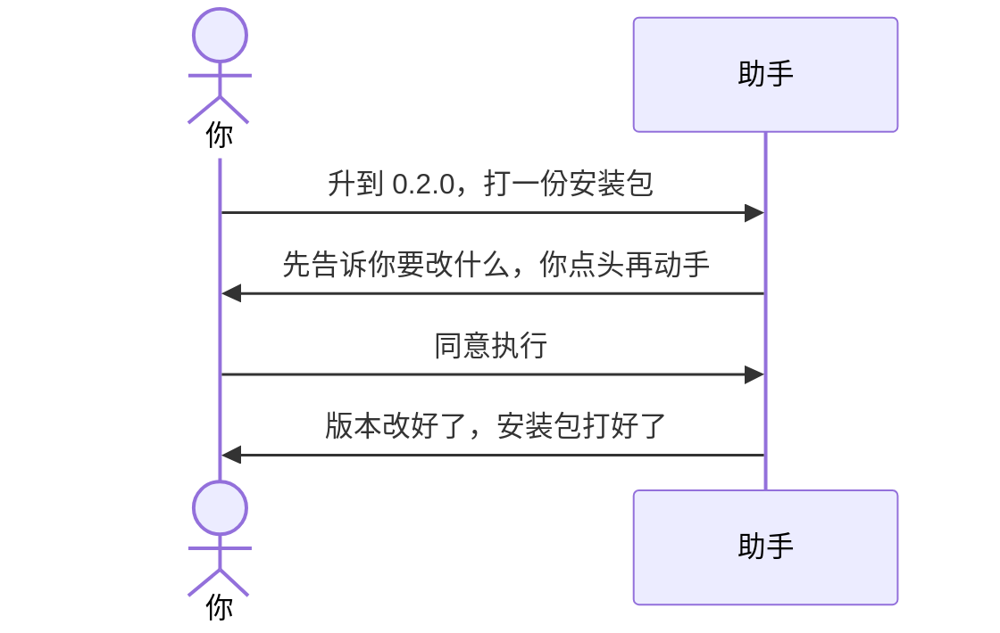

# 示例：初始化之后怎么打包

「会议速记」已经建好了。**不必再打开本包。** 把助手工作区指到那个文件夹，直接说升版本、打包。

> 假例子：林夏写完了第一版规则，要打一份 0.2.0 的安装包。

---



### 第 1 轮

**你**

> 把版本升到 0.2.0，打一份安装包。说明里写：补了纪要转行动项的规则。

**助手**

> 先把要改的地方列给你看，你点头我再改文件、再打包。确认前不动技能正文。
>
> 看完回复「同意执行」。

**你**

> 同意执行。

---

### 第 2 轮

**助手**

> 做好了。版本 0.2.0，安装包在这个文件夹里。开发用的说明没有打进包。没有往远程推（你没让推）。

---

## 你可以照着说

工作区换成**那个技能的文件夹**之后：

```text
把版本升到 0.2.0，打一份安装包。
```

不要再对本包说「初始化」或「升级这个 skill」。
