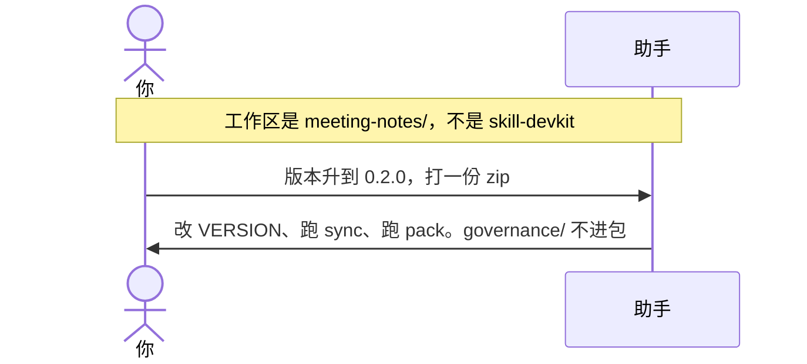
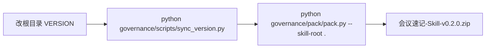

# 示例：初始化之后打包和升版本

`meeting-notes/` 已经初始化完。**从此不再调用 skill-devkit。** 版本号、打包脚本都在这个仓自己的 `governance/` 里。把助手工作区指到 `meeting-notes/`，当普通开发助手用即可。

> 假设定：林夏写完了第一版细则，要发 `0.2.0` 的 zip。

---

## 全过程





### 第 1 轮 · 开口（不要说「初始化」、不要说「你是 Agent A」）

**你**

> 把版本升到 0.2.0，打一份分发包。CHANGELOG 写：补了纪要转行动项的规则。

**助手**

> 这是 `meeting-notes` 自己的发版，不走 skill-devkit。
>
> 将要做：
>
> 1. 根目录 `VERSION` → `0.2.0`
> 2. `python governance/scripts/sync_version.py`（同步 `skill.json`）
> 3. `CHANGELOG.md` 加 0.2.0 段
> 4. `python governance/pack/pack.py --skill-root .`
>
> zip 里不会包含 `.git/` 和 `governance/`。可以做吗？

**你**

> 做。

---

### 第 2 轮 · 打好了

**助手**

| 做了 | 没做 |
|---|---|
| `VERSION` / `skill.json` / CHANGELOG 都是 0.2.0 | 没调用 skill-devkit |
| 打出 `会议速记-Skill-v0.2.0.zip` | 没把 `governance/` 打进包 |
| dry-run / 实打时可核对文件列表 | 没 push、没打 git tag（你没要求） |

发布前还可以过一遍 `governance/review-checklists/release-checklist.md`。

---

## 你可以照着说

工作区换成**那个 Skill 的文件夹**之后：

```text
把版本升到 0.2.0，打一份 zip。
```

```text
先 dry-run 看打包会带上哪些文件。
```

不要对 skill-devkit 说「升级这个 skill」「你是 Agent A」。那个包初始化完就退场了。
