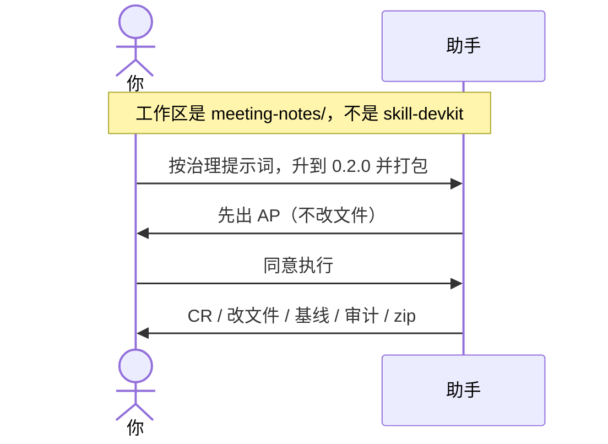
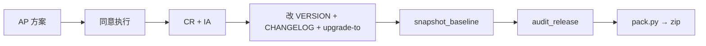

# 示例：初始化之后打包和升版本

`meeting-notes/` 已经初始化完。**从此不再调用 skill-devkit。** 版本控制、基线、升级记录、打包都在这个仓自己的 `governance/` 里，提示词是 `governance/rules/skill-governance.md`。把助手工作区指到 `meeting-notes/`。

> 假设定：林夏写完了第一版细则，要发 `0.2.0` 的 zip。

---

## 全过程





### 第 1 轮 · 开口（不要说「初始化」、不要对本包说）

**你**

> 按 governance/rules/skill-governance.md 处理。把版本升到 0.2.0，打一份分发包。CHANGELOG 写：补了纪要转行动项的规则。

**助手**

> 已读本仓治理规则，不走 skill-devkit。按规则先出 AP，确认前不改 `SKILL.md`。
>
> AP 草稿将写入 `governance/planning/upgrade-plan-v0.2.0.md`（概述、影响点、替代方案、文件清单、回归、回滚、版本影响）。
>
> 请审查。确认后回复「同意执行」。

**你**

> 同意执行。

---

### 第 2 轮 · 按本仓脚本发版

**助手**

| 做了 | 没做 |
|---|---|
| CR / IA / CHANGELOG 0.2.0 段 / `upgrade-to-0.2.0.md` | 没调用 skill-devkit |
| `VERSION` 与 `skill.json` 同步为 0.2.0 | 没改历史基线 `0.1.0/` |
| 新基线 `governance/baselines/0.2.0/` | 没把 `governance/` 打进包 |
| `audit_release.py` 通过；`会议速记-Skill-v0.2.0.zip` | 没 push（你没要求） |
| 该版本 AP 已删 | tag `v0.2.0` 等你说才打 |

---

## 你可以照着说

工作区换成**那个 Skill 的文件夹**之后：

```text
按 governance/rules/skill-governance.md 处理，不要直接改。先出 AP。升到 0.2.0 并打包。
```

不要对 skill-devkit 说「升级这个 skill」「你是 Agent A」。那个包初始化完就退场了。
