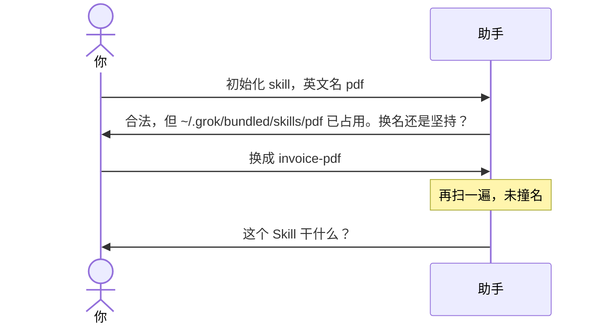

# 示例：英文名已被占用

合法英文名如果已经出现在助手的技能目录里，初始化不直接写盘，先问换名还是坚持。

> 假设定：空文件夹。林夏随口用了 `pdf`（助手里已有 bundled 的 pdf 技能）。

---

## 全过程



### 第 1 轮

**你**

> 初始化 skill，英文名 pdf。

**助手**

> `pdf` 符合英文名规则，但已经被占用：
>
> - `~/.grok/bundled/skills/pdf`（front matter `name: pdf`）
>
> 开发仓仍可以叫 `pdf`，装进助手时可能覆盖或并列冲突。
>
> 换一个英文名，还是坚持用 `pdf`？

**你**

> 换成 invoice-pdf。

**助手**

> `invoice-pdf` 未与已装 Skill 撞名。
>
> 这个 Skill 干什么？一句话就行。

之后同 [01-初始化空文件夹.md](01-初始化空文件夹.md) 从「干什么」继续。未决换名之前不问干什么、不写盘。

---

## 你可以照着说

```text
英文名 invoice-pdf，不要用已经装过的名字。
```
