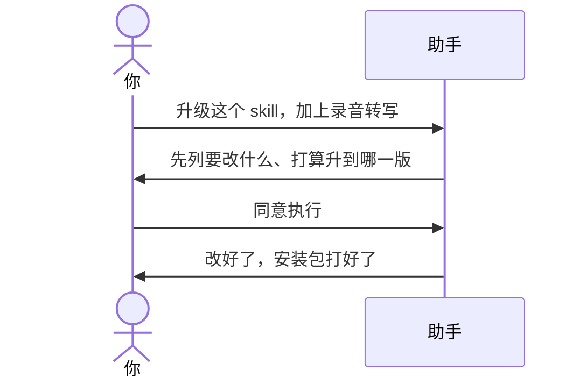

# 示例：初始化之后怎么升级

技能已经建好了。**不要再对本包说「升级」。** 把助手工作区指到那个技能的文件夹，直接说要改什么。

> 假例子：会议速记已经是 0.2.0。林夏要加一项：贴录音转写也能抽决议。

你不必报「升到几」。助手会看当前版本，先把要改的地方列出来，你回复「同意执行」才改文件、才打安装包。

---



### 第 1 轮 · 开口

**你**

> 升级这个 skill。给它加一个能力：贴录音转写也能抽决议，和贴纪要同一套。

**助手**

> 当前版本 0.2.0。这回要加：录音转写和纪要一样处理。我打算升到 0.3.0。
>
> 会动这些：
>
> - 贴转写和贴纪要走同一套整理
> - 别人还可以说「转写里的决议」
> - 旧的「贴一段纪要」必须还能用
>
> 我会测：有决议的转写、没有决议的转写、以前的贴纪要。
>
> 确认前不改技能正文。看完回复「同意执行」。

**你**

> 同意执行。

---

### 第 2 轮 · 做完

**助手**

> 做好了。版本 0.3.0，安装包在这个文件夹里。开发用的说明没有打进包。没有往远程推（你没让推）。

---

## 工作区指错了会怎样

还在空文件夹里，或还对着「Skill 开发工具包」说「升级」：助手会停，请你换成**那个技能的文件夹**。对话见 [09-对本包说升级会停.md](09-对本包说升级会停.md)。

---

## 一次只说一件事

新功能、修问题、重构不要混在一句话里。混了助手会请你拆开，这一轮只做一件。

---

## 你可以照着说

工作区换成**那个技能的文件夹**之后：

```text
升级这个 skill。给它加一个能力：贴录音转写也能抽决议。
```

也可以说：

```text
给会议速记加一个能力：……
写一份升级方案。
先出方案再改。
把版本升到 0.3.0。
```

最后一句带版本也可以，不带也行。不要再说「初始化」。只要打包、规则已经改完，见 [06-初始化之后怎么打包.md](06-初始化之后怎么打包.md)。
