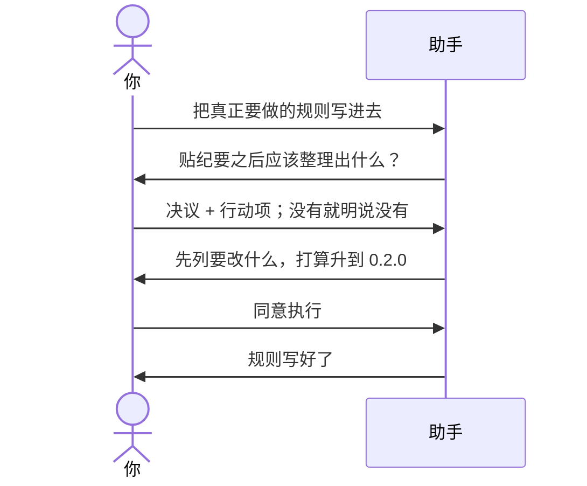

# 示例：初始化之后写规则

刚初始化完，文件夹里是空架子，技能还不会整理纪要。下一步就是把真正要做的规则写进去。这会改技能正文，所以仍然先列方案，你点头再写。

> 假例子：会议速记刚建成，版本 0.1.0。林夏要把「贴纪要 → 决议和行动项」写进去。

---



### 第 1 轮

**你**

> 把技能真正要做的规则写进去。

**助手**

> 现在还是空架子。第一步：你贴一段纪要之后，它应该整理出什么？

**你**

> 列出决议；每条跟一个行动项，写清谁来做、什么时候。没有决议就明说没有。不要编没说过的事。

---

### 第 2 轮 · 先列再改

**助手**

> 记下了。这会改技能正文，我打算升到 0.2.0。
>
> 会写上：
>
> - 怎么从纪要里抽决议和行动项
> - 没有决议时怎么说
> - 别人可以这样叫它：整理纪要、会议决议、行动项、贴一段纪要
>
> 我会测：有决议的纪要、没有决议的纪要、纪要里没说负责人时不要编。
>
> 确认前不改技能正文。看完回复「同意执行」。

**你**

> 同意执行。

---

### 第 3 轮

**助手**

> 规则写好了。版本 0.2.0。要打安装包直接说；要装到助手里试用，你开口我才拷。

---

## 你可以照着说

工作区留在**那个技能的文件夹**：

```text
把技能真正要做的规则写进去。
```

也可以把规则一句话说完：

```text
贴一段纪要，整理出决议和行动项；没有决议就明说没有，不要编。
```

升版本、加能力的完整说法见 [08-初始化之后怎么升级.md](08-初始化之后怎么升级.md)。打包见 [06-初始化之后怎么打包.md](06-初始化之后怎么打包.md)。
