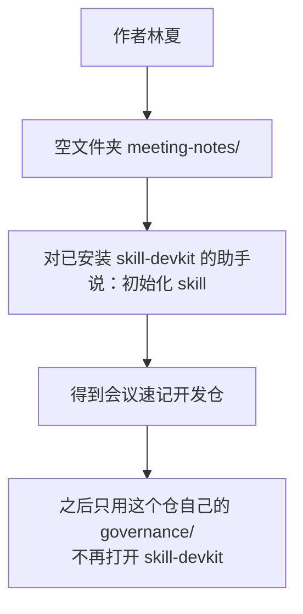
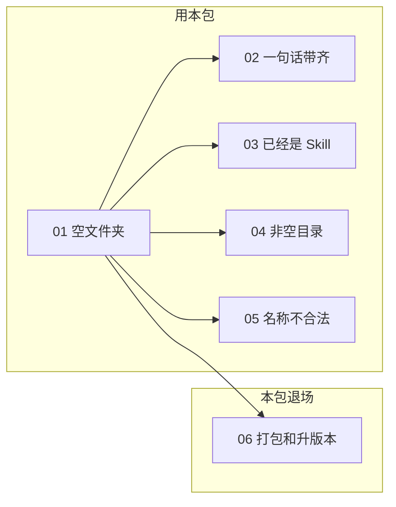

# 使用示例

这里是完整对话：你怎么开口、助手怎么问、你怎么拍板、文件夹里会出现什么。

人名、Skill 名都是假的，只保留真实用法。贯穿始终的假设定：



要做的 Skill：英文名 `meeting-notes`，显示名「会议速记」，把会议纪要收成决议和行动项。版权人林夏。

## 建议阅读顺序



| 文件 | 看什么 | 你开口可以这样说 |
|---|---|---|
| [01-初始化空文件夹.md](01-初始化空文件夹.md) | 主路径：问完再写盘 | 「初始化 skill」 |
| [02-一句话带齐信息.md](02-一句话带齐信息.md) | 说过的字段不再问 | 「开发一个 skill，英文名 meeting-notes，把纪要收成行动项」 |
| [03-已经是Skill仓.md](03-已经是Skill仓.md) | 有 `SKILL.md` 就拒绝再初始化 | 「再初始化一下」 |
| [04-非空目录.md](04-非空目录.md) | 目录里已有杂文件，须你点头 | 「把这个文件夹初始化成 skill」 |
| [05-名称不合法.md](05-名称不合法.md) | 中文名 / 空格过不了 | 先说「会议速记」当英文名 |
| [06-初始化之后打包和升版本.md](06-初始化之后打包和升版本.md) | 本包使命结束，用仓内 `governance/` | 「把版本升到 0.2.0 再打包」 |

助手提问的规矩（所有示例都这样）：

```text
一次只问一项（名字、干什么、显示名、版权）。
最后才给默认清单，你改完再说「按这个写」。

已经说过的字段，助手不会再问。
```
